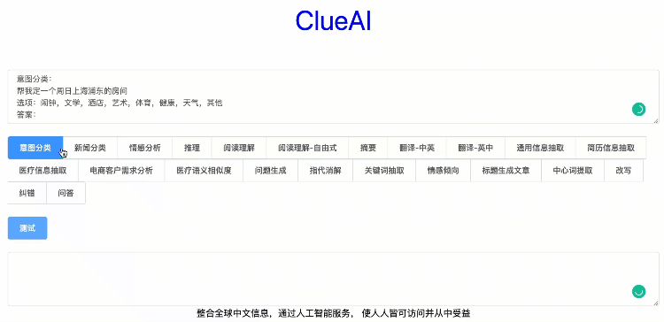

<p align="center">
<br>
<br>
<br>
<a href="https://clueai.cn"></>
<br>
<br>
<br>
<b>整合全球中文信息，通过人工智能服务， 使人人皆可访问并从中受益</b>
</p>


<p align=center>
<a href=""> </a>
<a href="https://pypi.org/project/clueai/"></a>
<a href="https://colab.research.google.com/drive/1H5J03ek3kpKschQ32mhX-y0JyRo1mIXN#scrollTo=zMSp1naSL8X9"> </a>
</p>

  

  

*Read this in other languages: [English](docs/README_en.md)

- [Python 软件包](#python-软件包)
  - [安装](#安装)
- [快速开始](#快速开始)
  - [免费试玩](#免费试玩)
  - [文本理解](#文本理解)
  - [信息抽取(NER)](#信息抽取ner)
  - [文本生成](#文本生成)
  - [模型微调](#模型微调)
    - [上传库-启动-调用](#上传库-启动-调用)
  - [文本生成图像](#文本生成图像)
    - [图片生成示例输入](#图片生成示例输入)
    - [图片生成示例输出](#图片生成示例输出)
  - [构建引擎服务（推荐/问答/搜索）](#构建引擎服务推荐问答搜索)
    - [上传库-->调用](#上传库--调用)
  - [示例输入](#示例输入)
  - [更大模型更好效果](#更大模型更好效果)
    - [文本分类](#文本分类)
    - [文本生成](#文本生成-1)
- [查看调用使用量](#查看调用使用量)
- [模型介绍](#模型介绍)
- [返回结果](#返回结果)
- [问题反馈和技术交流](#问题反馈和技术交流)

#### 更新 Update 2022-11-09(新)
新增模型微调功能：[模型微调](#模型微调) [上传库-启动-调用](#上传库-启动-调用)
#### 更新 Update 2022-09-29
PromptCLUE: 中文多任务Prompt预训练模型，已经开源！<a href='https://github.com/clue-ai/PromptCLUE'>github项目地址</a> | <a href='https://huggingface.co/ClueAI/PromptCLUE'>模型下载</a>

## Python 软件包

该软件包提供了开发的功能，以简化在python3中与clueai API的接口。

### 安装

可以使用 `pip`命令安装:

```bash
pip install --upgrade clueai
```

也可以通过源码:

```bash
python setup.py install
```
## 快速开始

### 免费试玩

* 使用colab一键运行使用
  
  [](https://colab.research.google.com/drive/1H5J03ek3kpKschQ32mhX-y0JyRo1mIXN#scrollTo=zMSp1naSL8X9)


效果对比--16类中文任务

|  任务类型  | PromptCLUE-base  | PromptCLUE-large    | 
| :----:| :----: | :----: | 
|  **分数** Score  | 63.47  | 70.55(+7.08)   | 
|   参数 Parameters  | 220M |  770M   |  
| **理解任务**（acc，10类） |  | | 
| 分类 classify | 89.56 | 92.89| 
| 情感分析 emotion_analysis | 80.55 | 85.64 | 
| 相似度计算 similar | 70.94 | 78.47 | 
| 自然语言推理 nli | 78.00 | 86.67 | 
| 指代消解 anaphora_resolution | 30.00 | 64.00| 
| 阅读理解 reading_comprehension | 71.69 | 84.78 | 
| 关键词提取 keywords_extraction | 41.44 | 47.78 | 
| 信息抽取 ner | 63.02 | 70.09 | 
| 知识图谱问答 knowledge_graph  | - | 53.11 |
| 中心词提取 Keyword_extraction | 66.50 |71.50 |  
| **生成任务**（rouge，6类） |  |   | 
| 翻译（英中、中英） nmt | 55.92 | 59.67 | 
| 摘要 summary | 31.71 | 34.48| 
| 问答 qa | 21.18 | 27.05 | 
| 生成（文章、问题生成） | 35.86 | 39.87 | 
| 改写 paraphrase | - | 57.68  | 
| 纠错 correct | - | 93.35  | 


### 文本理解
<table>
<tr>
<td> python 🔐 </td>
<td> curl 🔐⚡⚡ </td>
</tr>

<tr>
<td>

```python
import clueai
from clueai.classify import Example
cl = clueai.Client("", check_api_key=False)
response = cl.classify(
      model_name='clueai-base',
      task_name='产品分类',
      inputs=["强大图片处理器，展现自然美丽的你,,修复部分小错误，提升整体稳定性。", "求闲置买卖，精品购物，上畅易无忧闲置商城，安全可信，优质商品有保障"],
      labels = ["美颜", "二手", "外卖", "办公", "求职"])
print('prediction: {}'.format(response.classifications))
```
</td>
<td>

```python
curl --location --request POST 'https://www.modelfun.cn/modelfun/api/serving_api' \
    --header 'Content-Type: application/json' \
    --header 'Model-name: clueai-base' \
    --data '{
       "task_type": "classify",
       "task_name": "产品分类",
       "input_data": ["强大图片处理器，展现自然美丽的你,,修复部分小错误，提升整体稳定性。", "求闲置买卖，精品购物，上畅易无忧闲置商城，安全可信，优质商品有保障"],
       "labels": ["美颜", "二手", "外卖", "办公", "求职"]
       }'

```
</td>

</tr>
</table>


### 信息抽取(NER)
<table>
<tr>
<td> python 🔐 </td>
<td> curl 🔐⚡⚡ </td>
</tr>

<tr>
<td>

```python
import clueai

# initialize the Clueai Client with an API Key
cl = clueai.Client("", check_api_key=False)
prompt= '''
信息抽取：
据新华社电广东省清远市清城区政府昨日对外发布信息称,日前被实名举报涉嫌勒索企业、说“分分钟可以搞垮一间厂”的清城区环保局局长陈柏,已被免去清城区区委委员
问题：机构名，人名，职位
答案：
'''
prediction = cl.generate(
        model_name='clueai-base',
        prompt=prompt) 
# 需要返回得分的话，指定return_likelihoods="GENERATION"
         
# print the predicted text          
print('prediction: {}'.format(prediction.generations[0].text))
```
</td>
<td>

```python
curl --location --request POST 'https://www.modelfun.cn/modelfun/api/serving_api' \
    --header 'Content-Type: application/json' \
    --header 'Model-name: clueai-base' \
    --data '{
       "task_type": "generate",
       "task_name": "信息抽取",
       "input_data": ["信息抽取：\n据新华社电广东省清远市清城区政府昨日对外发布信息称,日前被实名举报涉嫌勒索企业、说“分分钟可以搞垮一间厂”的清城区环保局局长陈柏,已被免去清城区区委委员\n问题：机构名，人名，职位\n答案："]
       }'

```
</td>

</tr>
</table>

### 文本生成
<table>
<tr>
<td> python 🔐 </td>
<td> curl 🔐⚡⚡ </td>
</tr>

<tr>
<td>

```python
import clueai

# initialize the Clueai Client with an API Key
cl = clueai.Client("", check_api_key=False)
prompt= '''
摘要：
本文总结了十个可穿戴产品的设计原则，而这些原则，同样也是笔者认为是这个行业最吸引人的地方：1.为人们解决重复性问题；2.从人开始，而不是从机器开始；3.要引起注意，但不要刻意；4.提升用户能力，而不是取代人
答案：
'''
# generate a prediction for a prompt 

generate_config = {
    "do_sample": True,
    "top_p": 0.8,
    "max_length": 128,
    "min_length": 10,
    "length_penalty": 1.0,
    "num_beams": 1
  }
# 如果需要自由调整参数自由采样生成，添加额外参数信息设置方式：generate_config=generate_config
prediction = cl.generate(
        model_name='clueai-base',
        prompt=prompt) 
# 需要返回得分的话，指定return_likelihoods="GENERATION"
         
# print the predicted text          
print('prediction: {}'.format(prediction.generations[0].text))
```
</td>
<td>

```python
curl --location --request POST 'https://www.modelfun.cn/modelfun/api/serving_api' \
    --header 'Content-Type: application/json' \
    --header 'Model-name: clueai-base' \
    --data '{
       "task_type": "generate",
       "task_name": "摘要",
       "input_data": ["摘要：\n本文总结了十个可穿戴产品的设计原则，而这些原则，同样也是笔者认为是这个行业最吸引人的地方：1.为人们解决重复性问题；2.从人开始，而不是从机器开始；3.要引起注意，但不要刻意；4.提升用户能力，而不是取代人\n答案："]
       }'

```
</td>

</tr>
</table>

### 模型微调
#### 上传库-启动-调用
说明：
1. 上传需要微调的数据，自动训练微调/部署模型，提供接口使用
2. 上传的数据为json格式，参考./examples/finetune_train_examples.json
3. 基于promptCLUE模型微调，建议参考prompt提示的格式构建数据集，效果会更好，prompt格式可以参考下面[示例输入](#示例输入)的形式
4. 需要有个API key， 并且在创建`clueai.Client`对象时需要指定这个API key. API key 可以通过这个[平台](https://www.clueai.cn/)获得，方法： 点击[官网](https://www.clueai.cn/)右上角立即使用-注册登陆后-右上角有创建apikey-创建apikey
5. 微调数据数量限制1w条，超过会被采样，如果需要微调更大数量请与我们联系，联系方式见最下方
6. 完整代码可参考：[](https://colab.research.google.com/drive/1H5J03ek3kpKschQ32mhX-y0JyRo1mIXN#scrollTo=zMSp1naSL8X9)
7. 默认启动模型推理服务后，会保持10分钟，超时会断开
<table>
<tr>
<td> 上传文件 🔐 </td>
<td> 启动模型 🔐 </td>
<td> 调用模型 🔐 </td>
</tr>

<tr>

<td>

```python
# 上传少量微调数据，指定输入和输出字段， input_field和target_field分别指你需要微调的输入和输出字段
import clueai
api_key=""
cl = clueai.Client(api_key)
response = cl.upload_finetune_corpus(
      file_path="finetune_train_examples.json",
      input_field="input",
      target_field="target"
      )

if "engine_key" in response:
  engine_key = response["engine_key"]
  print("engine key: ", engine_key)
else:
  print(response)
```
</td>

<td>

```python
import clueai
cl = clueai.Client(api_key)
# engine_key 指定你训练模型的key
response = cl.start_finetune_model(
        engine_key=engine_key)
print(response)
```
</td>

<td>

```python
import clueai

# initialize the Clueai Client with an API Key
cl = clueai.Client(api_key)
prompt= '''以下两句话的意思相同的吗？
“花呗已经退还 可是我还没收到”，“我的花呗最迟还款是几号”。
选项：是的，不是。
答案：'''
# generate a prediction for a prompt

generate_config = {
    "do_sample": True,
    "top_p": 0.8,
    "max_length": 128,
    "min_length": 10,
    "length_penalty": 1.0,
    "num_beams": 1
  }
# 如果需要自由调整参数自由采样生成，添加额外参数信息设置方式：generate_config=generate_config
prediction = cl.finetune_generate(
        engine_key=engine_key,
        prompt=prompt)
# print the predicted text
print('prediction: {}'.format(prediction.generations[0].text))
```
</td>
</tr>
</table>


  
### 文本生成图像
* 文本生成图像可以直接使用[绘画师](https://clueai.cn/clueai/t2i/) <a href="https://clueai.cn/clueai/t2i/" target="_blank"></a>
<table>
<tr>
<td> python 🔐 </td>
</tr>

<tr>
<td>

```python
import clueai
from PIL import Image
cl = clueai.Client("", check_api_key=False)
response = cl.text2image(
      model_name='clueai-base',
      prompt="秋日的晚霞",
      style="毕加索",
      out_file_path="test.png") 

im = Image.open('test.png')
im.show()
```
</td>

</tr>
</table>

#### 图片生成示例输入
```bash
prompt: 秋日的晚霞
```


```bash
prompt: 室内设计
```


```bash
prompt: 婚礼鲜花
```


```bash
prompt: 浩瀚星空
```


```bash
prompt: 浩瀚星空
style: 梵高
```


```bash
prompt: 远处有雪山的蓝色湖泊，蓝天白云，很多鸟
```

#### 图片生成示例输出

<p float="left">
      
      
    
    
    
    
</p>  

### 构建引擎服务（推荐/问答/搜索）
#### 上传库-->调用
首先通过上传数据文件(json)和指定需要查询的文本字段，借助clueai构建独立引擎服务； 
然后通过传入需要推荐/问题的query和引擎的engine_key即可使用, 可以参考examples下的test.json

<table>
<tr>
<td> 上传文件 🔐 </td>
<td> 调用引擎 🔐 </td>
</tr>

<tr>

<td>

```python
import clueai
cl = clueai.Client("", check_api_key=False)
response = cl.upload_corpus(
      model_name='clueai-base',
      file_path="./examples/law_test.json",
      field="title"
      )
engine_key = response["engine_key"]
print("engine key: ", engine_key)
```

</td>
<td>

```python
import clueai
cl = clueai.Client("", check_api_key=False)
response = cl.search(
      model_name='clueai-base',
      engine_key=engine_key,
      query="法律案例"
      )
print('prediction: {}'.format(response.matches))
```

</td>
</tr>
</table>

### 示例输入
新闻分类(classify)
```bash
Input:
新闻分类：
今天（3日）稍早，中时新闻网、联合新闻网等台媒消息称，佩洛西3日上午抵台“立法院”，台湾新党一早8时就到台“立法院”外抗议，高喊：“佩洛西，滚蛋！”台媒报道称，新党主席吴成典表示，佩洛西来台一点道理都没有，“平常都说来者是客，但这次来的是祸！是来祸害台湾的。”他说，佩洛西给台湾带来祸害，“到底还要欢迎什么”。
选项：财经，法律，国际，军事
答案：

Model output:
国际
```

意图分类(classify)
```bash
Input:
意图分类：
帮我定一个周日上海浦东的房间
选项：闹钟，文学，酒店，艺术，体育，健康，天气，其他
答案：

Model output:
酒店
```

情感分析(classify)
```bash
Input:
情感分析：
这个看上去还可以，但其实我不喜欢
选项：积极，消极
答案：

Model output:
消极
```

推理(generate)
```bash
Input:
推理关系判断：
前提：小明今天在北京
假设：小明在深圳旅游
选项：矛盾，蕴含，中立
答案：

Model output:
矛盾
```

阅读理解(generate)
```bash
Input:
阅读理解：
段落：海外网8月2日电据美国《国会山报》8月1日报道，三名美国众议院议员日前致信美国政府问责局（GAO），要求审查联邦政府应对猴痘疫情的措施是否充分。
在信中，三名众议员称美国的公共卫生系统“严重受损”，联邦政府应对猴痘疫情行动迟缓，分发试剂和疫苗的工作出现延误，影响了遏制疫情传播的能力，而数百万剂的猴痘疫苗历经数月才获得批准，从一家丹麦工厂发往美国。
议员们还要求美国政府问责局审查美疾病控制和预防中心、食品和药物管理局、国土安全部，查明这些联邦机构是否为应对猴痘疫情做出了充分准备，是否借鉴了应对新冠疫情的经验教训。
美媒称，几个星期以来，美国国会议员频频就猴痘疫情应对措施向联邦政府施压，呼吁政府宣布进入公共卫生紧急状态。截至目前，美国疾病控制与预防中心已经确认了5000多例猴痘病例。考虑到仍有许多民众无法进行猴痘病毒检测，当前的病例数可能被低估。
问题：联邦政府应对疫情有什么问题？
答案：

Model output:
联邦政府应对猴痘疫情行动迟缓,分发试剂和疫苗的工作出现延误,影响了遏制疫情传播的能力
```
阅读理解-自由式(generate)
```bash
Input:
阅读以下对话并回答问题。
男：今天怎么这么晚才来上班啊？女：昨天工作到很晚，而且我还感冒了。男：那你回去休息吧，我帮你请假。女：谢谢你。
问题：女的怎么样？
选项：正在工作，感冒了，在打电话，要出差。
答案：

Model output:
感冒了
```

摘要(generate)
```bash
Input:
为下面的文章生成摘要：
北京时间9月5日12时52分，四川甘孜藏族自治州泸定县发生6.8级地震。地震发生后，领导高度重视并作出重要指示，要求把抢救生命作为首要任务，全力救援受灾群众，最大限度减少人员伤亡
答案：

Model output:
四川甘孜州泸定县发生6.8级地震
```

翻译-中英(generate)
```bash
Input:
翻译成英文：
议长去了台湾，中国人民很愤怒。
答案：

Model output:
The Speaker went to Taiwan, and the Chinese people were angry.
```

翻译-英中(generate)
```bash
Input:
翻译成中文：
This is a dialogue robot that can talk to people.
答案：

Model output:
这是一个能与人对话的机器人。
```
通用信息抽取(generate)
```bash
Input:
信息抽取：
据新华社电广东省清远市清城区政府昨日对外发布信息称,日前被实名举报涉嫌勒索企业、说“分分钟可以搞垮一间厂”的清城区环保局局长陈柏,已被免去清城区区委委员
问题：机构名，人名，职位
答案：

Model output:
机构名:新华社,清城区环保局,清城区区委
人名:陈柏
职位:局长
```

简历信息抽取(generate)
```bash
Input:
阅读文本抽取关键信息：
张玄武2000年出生中国国籍无境外居留权博士学历现任杭州线锁科技技术总监。
问题：机构，人名，职位，籍贯，专业，国籍，学历，种族
答案：

Model output:
机构:杭州线锁科技
人名:张玄武
职位:技术总监
国籍:中国国籍
学历:博士学历```
```

医疗信息抽取(generate)
```bash
Input:
找出指定的信息：
我今天胃不舒服，手有点麻木，浑身不舒服，前几天去医院医生说我有胃炎
问题：症状，治疗，检查，身体部位，疾病
答案：

Model output:
症状:胃不舒服,麻木,浑身不舒服,胃炎
```

电商客户需求分析(classify)
```bash
Input:
电商客户诉求分类：
收到但不太合身，可以退换吗
选项：买家咨询商品是否支持花呗付款，买家表示收藏关注店铺，买家咨询退换货规则，买家需要商品推荐
答案：

Model output:
买家咨询退换货规则
```

医疗语义相似度(classify)
```bash
Input:
下面句子是否表示了相同的语义：
文本1：糖尿病腿麻木怎么办？
文本2：糖尿病怎样控制生活方式
选项：相似，不相似
答案：

Model output:
不相似
```

问题生成(generate)
```bash
Input:
问题生成：
中新网2022年9月22日电 22日，商务部召开例行新闻发布会，商务部新闻发言人束珏婷表示，今年1-8月，中国实际使用外资1384亿美元，增长20.2%；其中，欧盟对华投资增长123.7%(含通过自由港投资数据)。这充分表明，包括欧盟在内的外国投资者持续看好中国市场，希望继续深化对华投资合作。
答案：

Model output:
1、今年1-8月,中国实际使用外资增长了多少? 2、欧盟对华投资增长了多少? 
```

指代消解(generate)
```bash
Input:
代词指向哪个名词短语：
段落：
当地时间9月21日，英国首相特拉斯在纽约会见了美国总统拜登。随后她便在推特上发文强调，英美是坚定盟友。推文下方还配上了她（代词）与拜登会面的视频。
问题：代词“她”指代的是？
答案：

Model output:
特拉斯 
```

关键词抽取(generate)
```bash
Input:
 抽取关键词：
当地时间21日，美国联邦储备委员会宣布加息75个基点，将联邦基金利率目标区间上调到3.00%至3.25%之间，符合市场预期。这是美联储今年以来第五次加息，也是连续第三次加息，创自1981年以来的最大密集加息幅度。
关键词：

Model output:
美联储,加息75个基点,加息幅度
```


情感倾向(classify)
```bash
文字中包含了怎样的情感：
超可爱的帅哥，爱了。。。
选项：厌恶，喜欢，开心，悲伤，惊讶，生气，害怕
答案：

Model output::
喜欢
```

文章生成(generate)
```bash
Input:
根据标题生成文章：
标题：俄罗斯天然气管道泄漏爆炸
答案：

Model output:
新华网莫斯科6月12日电(记者贺颖骏)俄罗斯紧急情况部新闻处12日证实，俄罗斯南部特罗伊茨克州的一条天然气管道12日发生泄漏爆炸，目前已造成至少20人死亡。“据俄紧急情况部新闻局发表的声明，管道是俄罗斯特罗伊茨克斯天然气工业公司运营的一部分。管道的一处出口受到影响，天然气被泄漏的气体引燃。“声明没有说明天然气管道发生爆炸的原因。“目前，当地消防部门正在全力灭火。
```

中心词提取(generate)
```bash
中心词提取：
现在有京东国际太方便了，可以安全的买到正经的电子设备，游戏机完全没问题，发货非常快，第二天就到
答案：

Model output:
京东国际
```

改写(generate)
```bash
生成与下列文字相同意思的句子：
长期通胀前景在今天可能不确定性更大。
答案：

Model output:
如今，长期通胀前景不确定性可能更大。
```

纠错(generate)
```bash
文本纠错：
你必须服从命令，不要的考虑。你的思想被别人手下来。
答案：

Model output:
你必须服从命令，不要考虑。你的思想被别人打下来。
```

问答(generate)
```bash
问答：
问题：阿里巴巴的总部在哪里：
答案：

Model output:
浙江省杭州市
```

### 更大模型更好效果

在用更大模型之前，你需要有个API key， 并且在创建`clueai.Client`对象时需要指定这个API key. API key 可以通过这个[平台](https://www.clueai.cn/)获得，下面是有关分类和生成任务的一个基本的示例, 可以通过接口查看调用使用量

#### 文本分类
<table>
<tr>
<td> python 🔐 </td>
<td> curl 🔐⚡⚡ </td>
</tr>

<tr>
<td>

```python
import clueai
from clueai.classify import Example
# initialize the Clueai Client with an API Key
cl = clueai.Client('YOUR_API_KEY')
# 如果查看api_key的使用量可以通过 print(cl.check_usage())
response = cl.classify(
  model_name='clueai-large',
  task_name='情感分析',
  task_name='产品分类',
  inputs=["强大图片处理器，展现自然美丽的你,,修复部分小错误，提升整体稳定性。", "求闲置买卖，精品购物，上畅易无忧闲置商城，安全可信，优质商品有保障"],
  labels = ["美颜", "二手", "外卖", "办公", "求职"])

print('prediction: {}'.format(response.classifications))
```
</td>
<td>

```python
curl --location --request POST 'https://www.modelfun.cn/modelfun/api/serving_api' \
  --header 'Content-Type: application/json' \
  --header 'Model-name: clueai-large' \
  --header 'Api-Key: BEARER {api_key}' \
  --data '{
       "task_type": "classify",
       "task_name": "产品分类",
       "input_data": ["强大图片处理器，展现自然美丽的你,,修复部分小错误，提升整体稳定性。", "求闲置买卖，精品购物，上畅易无忧闲置商城，安全可信，优质商品有保障"],
       "labels": ["美颜", "二手", "外卖", "办公", "求职"]
       }'
```
</td>

</tr>
</table>

#### 文本生成
<table>
<tr>
<td> python 🔐 </td>
<td> curl 🔐⚡⚡ </td>
</tr>

<tr>
<td>

```python
import clueai

# initialize the Clueai Client with an API Key
cl = clueai.Client('YOUR_API_KEY')
prompt= '''
摘要：
本文总结了十个可穿戴产品的设计原则，而这些原则，同样也是笔者认为是这个行业最吸引人的地方：1.为人们解决重复性问题；2.从人开始，而不是从机器开始；3.要引起注意，但不要刻意；4.提升用户能力，而不是取代人
答案：
'''
# generate a prediction for a prompt 
prediction = cl.generate(
            model_name='clueai-large',
            prompt=prompt)
            
# print the predicted text          
print('prediction: {}'.format(prediction.generations[0].text))
```
</td>
<td>

```python
curl --location --request POST 'https://www.modelfun.cn/modelfun/api/serving_api' \
    --header 'Content-Type: application/json' \
   --header 'Model-name: clueai-large' \
  --header 'Api-Key: BEARER {api_key}' \
    --data '{
       "task_type": "generate",
       "task_name": "摘要",
       "input_data": ["摘要：\n本文总结了十个可穿戴产品的设计原则，而这些原则，同样也是笔者认为是这个行业最吸引人的地方：1.为人们解决重复性问题；2.从人开始，而不是从机器开始；3.要引起注意，但不要刻意；4.提升用户能力，而不是取代人\n答案："]
       }'

```
</td>

</tr>
</table>

## 查看调用使用量

```python
import clueai

# initialize the Clueai Client with an API Key
# 微调用户finetune_user=True
cl = clueai.Client('YOUR_API_KEY')
print(cl.check_usage(finetune_user=False)) 
```

## 模型介绍

当您调用clueai的API时，我们为您的用例指定默认模型。 默认模型非常适合您开始使用，但是在生产环境中，我们建议您通过`model_name`参数自己指定特定模型。

## 返回结果

对于不同的任务返回相对应的clueai对象（例如，对于分类，将是“Classification”）。 

ClueAI 被[ClueAI](https://clueai.cn) 支持，并且相关协议可以查看[licensed](./LICENSE).

## 问题反馈和技术交流
  
<p float="left">
      
   
    
</p> 


